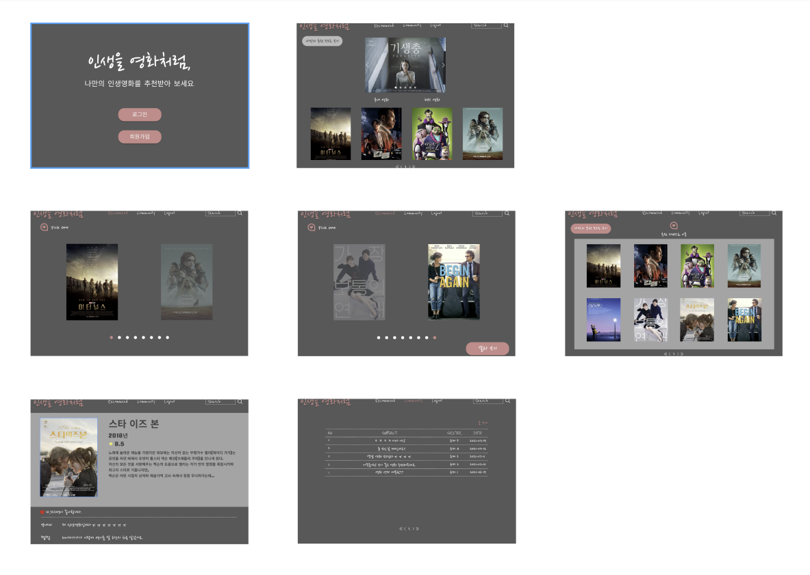
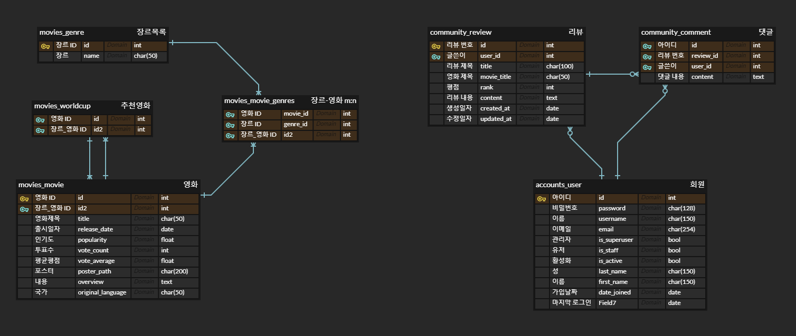
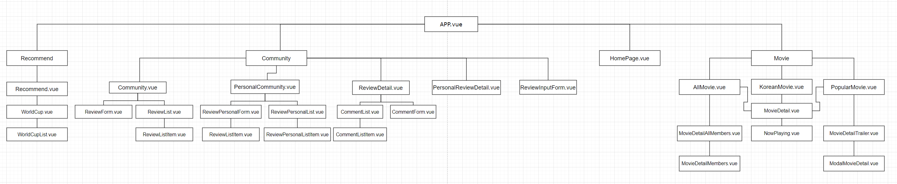
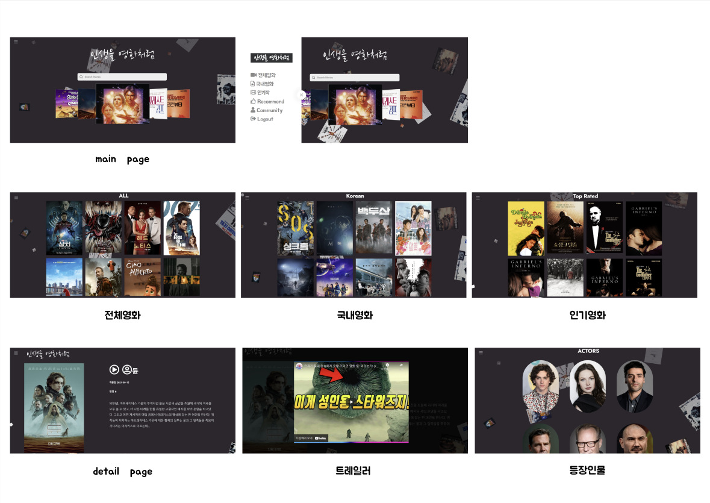
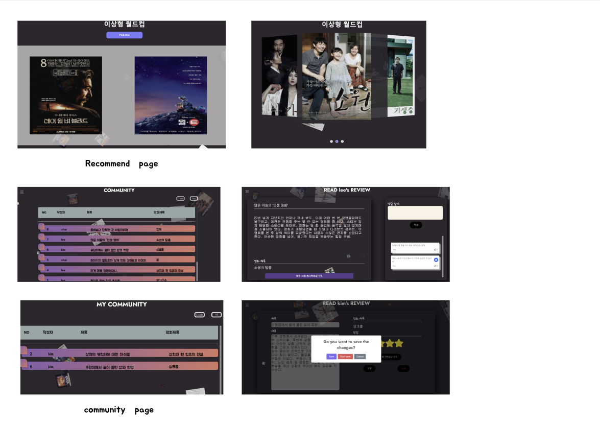

# Final pjt 

> 🎬 영화 추천 및 커뮤니티 서비스 등을 포함한 실제 서비스 설계

<br>

[[_TOC_]]

## 0️⃣ Intro

### 인생을 영화처럼

그 순간에 선호하는 영화를 선택하여 사용자의 선택에 기반한 장르의 영화를 추천해주면서 하루하루를 영화처럼 살기를 바라는 마음에서 착안되었다. 

<br>

### 팀명 및 팀원

#### NO LOOK PASS 

보지 않고 팀원에게 패스를 할 정도로 서로를 믿고 호흡이 좋다는 의미이다.

|  팀원  |                     역할                     |                       REFERENCE                       |
| :----: | :------------------------------------------: | :---------------------------------------------------: |
| 김동현 |  Front-end, Back-end (Movie Detail Feature)  | [KIMDONGHYEON003](https://github.com/KIMDONGHYEON003) |
| 이수민 | Front-end, Back-end (Recommendation Feature) |     [breathinlee](https://github.com/breathinlee)     |
| 최종현 |   Front-end, Back-end (Community Feature)    |  [Jonghyunchoi94](https://github.com/Jonghyunchoi94)  |


#### 세부 역할 분담

김동현

- 전체 영화 / 국내 영화 / 인기작 front 구성
- front 전체 스타일 수정
- Movie Detail 페이지 front 수정

이수민

- Login / Signup 기능 구현 및 front 구성
- 영화 추천 서비스 기능 구현 및 front 구성
- 메인 페이지 front 수정

최종현

- API 활용 데이터 수집 
- Movie Detail 페이지 구성 및 Login 오류 수정
- Community 페이지 기능 구현 및 front 구성
- 추가 기능 구현(search 기능/carousel/Detail 페이지에 트레일러, 출연 배우 정보)

<br>

### 개발환경

1. 아키텍처

   Django REST API 서버 & Vue.js

   

2. 프로젝트 활용 도구

   Figma, ERD cloud, notion

   

3. 제작기간

   2021/11/15 - 2021/11/25

<br>

### 필수 기능

- admin 페이지
- Database Seeding을 활용한 최소 50개 이상의 데이터 포함
- 영화 추천 알고리즘
- 커뮤니티 
  - 로그인한 사용자만 글 조회/생성 가능
  - 작성자 본인만 글 수정/삭제 가능
  - 게시글에 댓글 기능
- 기타
  - 최소 5개 이상의 URL 및 페이지 구성
  - 메시지 프로임워크 등을통한 에러 페이지 구성
  - Ajax활용한 비동기 요청

<br>

## 1️⃣ Design Thinking

### 페르소나

- 다양한 장르의 영화 추구하는 MZ세대
- 복잡한 UI를 싫어하고 편리하게 원하는 영화에 대한 정보를 얻고 싶음
-  생소한 영화라도 예고편과 등장인물을 살펴보고 영화 선택

<br>

### 초기 UI 프로토 타입



<br>

### 목표 기능

- [x] 사용자 행동 기반 영화 추천 서비스 적용
- [ ] 다크모드와 같은 화면 전환 버튼 
- [x] SearchBar 구현
- [x] 국내영화 / 해외영화 분류  => 인기작 / 국내영화로 분류
- [x] 예고편 / 등장인물 관련 정보 제공

<br>

### 영화 추천 서비스

- 이상형 월드컵을 통해 파악한 장르별 영화 추천
- 음악 API를 활용한 OST 기반 영화 추천
- 빙고게임 통한 영화 추천
- 메인 페이지에 띄워진 영화 포스터 혹은 단어들에 대하여 클릭하면 클릭 결과 반영하여 영화 추천

<br>

### 데이터 수집

TMDB API를 활용하여 영화 데이터 수집

<br>

## 2️⃣ 실제 구현 서비스

### 컨셉

*영화는 좋아하지만, 아직 명확히 자기 취향을 모르는 MZ세대에게 이상형 월드컵을 통해 자신이 선호하는 장르기반 영화를 추천해주는 서비스* 

<br>

### ERD



<br>

### Front (Vue component 구조)



<br>

### 실제 구현 기능

- [x] detail 페이지에 ▶ 클릭 시 모달창 활용한 트레일러 재생
- [x] detail 페이지에 영화 등장인물 관련 상세페이지 
- [x] SearchBar 검색 기능 -> 검색 시 연관 검색어 지정
- [x] Community 글 작성 시 영화 검색 기능 -> 검색 시 연관 검색어 지정
- [x] 이상형 월드컵 활용한 영화 추천 

<br>

### 최종 Web Page





<br>

## 3️⃣ 필수기능

### Movie Page(전체 영화/국내 영화/인기 영화)

Front end

- App.vue 파일에서 라우터 링크를 지정하여 각각의 페이지를 표시할 수 있게 설정

```vue
<nav class="sidebar__menu">
  <router-link :to="{ name: 'AllMovies' }">전체영화</router-link>
  <router-link :to="{ name: 'KoreanMovies' }">국내영화</router-link>
  <router-link :to="{ name: 'PopularMovies' }">인기작</router-link>
  <router-link :to="{ name: 'Recommend' }">Recommend</router-link> 
  <router-link :to="{ name: 'Community' }">Community</router-link>
  <router-link @click.native="logout" to="#">Logout</router-link>
</nav>
```

- 각각의 vue파일을 생성하여 name 설정 후 NowPlaying.vue 파일을 import하고 components로 `NowPlaying.vue`설정 후 template에 `<now-playing>`추가

  - 예시) `AllMovies.vue` (KoMovies.vue & PopularMovies.vue 페이지 동일)

  ```vue
  <template>
    <div id="allmovie">
      <h1>ALL</h1>
      <div class="scroll" style="overflow:scroll; height:850px; overflow-x:hidden;" >
        <div class="image-wrapper" style="width: 80%; ">
          <now-playing
            v-for="movieCard in allMovieCards"
            :key="movieCard.id"
            :movieCard="movieCard"
            class="card"
          >
          </now-playing>
        </div>
      </div> 
    </div>
  </template>
  
  <script>
  import NowPlaying from '@/components/Movies/NowPlaying.vue'
  import {mapState} from 'vuex'
  
  export default {
    name: 'AllMovies',
    components: { 
      NowPlaying
    },
    data: function () {
      return {
        movieCard: [],      
      } 
    },
    created: function () {
      this.$store.dispatch('LoadAllMovieCards')
    },
    computed: {
      ...mapState([
        'allMovieCards'
      ])
    },
  }
  ```

<br>

### Detail Page

Front end

- NowPlaying.vue 파일의 영화를 클릭했을 때, detail 페이지로 이동할 수 있도록 ``` @click.prevent="LoadMovieDetail(movieCard)``` 와 props 추가
- 전역에서 관리할 LoadMovieDetail 함수 생성 후 MovieDetail.vue에서 mapState import 설정

<br>

🤯 어려웠던 점

- axios에서 url을 설정할 때, url 경로를 잘못 지정해서 오류 발생

- store/index.js 파일에서 LoadMovieDetail 함수를 생성할 때, 요청 받을 정보를 잘못 지정하여 오류 발생

  => 해당 요청 id를 url에 넣어주어야 영화 정보를 얻을 수 있음

😢 해결과정

- api 경로를 제대로 확인하지 않은 실수였기 때문에 확인 후 수정
- request.id로 요청값을 변경한 뒤 url에 추가

```js
LoadMovieDetail: function ({ commit }, request) {
  axios({
    url: `http://api.themoviedb.org/3/movie/${request.id}`,
    method: 'get',
    params: {
      api_key: process.env.VUE_APP_TMDB_API_KEY,
      language: 'ko-KR',
    }
  })
```

<br>

➕ **detail 페이지 내 배우 정보**

Front end

- 배우 정보를 받기 위해 전역에서 LoadMovieCredits 함수 생성

- 가져온 정보가 castMembers 에 담길 수 있도록 state와 mutation 설정

  ```js
  mutations: {
    LOAD_MOVIE_CREDITS: function (state, results) {
      state.castMembers = results
    },
  }
  
  actions: {
    LoadMovieCredits: function ({ commit }, request) {
      axios({
        url: `http://api.themoviedb.org/3/movie/${request.id}/credits`,
        method: 'get',
        params: {
          api_key: process.env.VUE_APP_TMDB_API_KEY,
          language: 'ko-KR',
        }
      })
      .then((res) => {  
        commit('LOAD_MOVIE_CREDITS', res.data.cast)
        router.push({name: 'MovieDetailAllMembers', params: {movieNumber : request.id}})
          })
      .catch((err) => {
        console.log(err)
      })
    },
  }
  ```

- `MovieDetailMembers.vue` 에 배우 한 사람씩 담길 수 있도록 components/Movies 경로로 파일 생성 후 상위 폴더인 `MovieDetailAllMembers.vue`에 import 후 components에 추가하고 template에 movie-detail-members 태그를 이용하여 castMember 추가

  ```vue
  <template>
    <div>
      <h1>ACTORS</h1>
      <div class="scroll" style="overflow:scroll; height:850px; overflow-x:hidden; " >
        <div class="image-wrapper" style="width: 80%; ">
          <movie-detail-members
            v-for="castMember in castMembers"
            :key="castMember.id"
            :castMember="castMember"
            style="border-radius:200px;height:350px; margin:3%;"
  
          ></movie-detail-members>
        </div>
      </div>
    </div>
  </template>
  ```

<br>

### 추천 알고리즘

Back end

- DB에 저장된 영화에서 랜덤으로 8개 선정
  - `random.sample`을 활용하여 8개를 뽑은 후 `worldcup` 모델에 데이터 저장

Front end

- `axios`를 활용하여 랜덤으로 뽑힌 8개의 영화에 대한 정보를 받아오고 각 영화에 대한 detail을 받아 옴
- 받아 온 정보를 store에 저장하여 전역에서 관리
- `worldcup.vue`에서 8개의 영화 중 2개씩을 랜덤으로 뽑아서 보여줌
  - lodash의 `samplesize`활용

- 각 라운드에서 사용자의 선택을 저장하여 가장 많이 나온 장르를 계산하여 그 장르에 해당하는 영화 3개 추천
  - 영화 중 여러 개의 장르를 갖고 있는 것 존재
  - 장르에 대한 정보를 모두 담아 각각의 장르의 개수를 계산하여 가장 많이 나온 장르를 선정(중복도 허용)
  - `axios`를 통해 `best genre` 로 뽑힌 장르(들)에 해당하는 영화를 모두 받아와 lodash의 `samplesize`를 다시 한번 사용하여 랜덤으로 3개 선정해서 추천 

<br>

🤯 어려웠던 점

- movies/serializers.py 에 `GenreListSerializer`의 fields에 id를 추가하지 않아 best genre에 드라마, 코믹과 같은 장르의 이름만 저장이 됨

  => 각 장르에 해당하는 id를 찾아 그 id로 장르별 영화의 정보를 받아오는 이중 과정에서 로직을 구현하는 것이 매우 어려웠음

- vue에서 전역에서 관리하는 데이터와 각 컴포넌트에서 다루는 데이터의 이름의 혼동

- 전역에서 관리하는 8개의 랜덤 영화가 담긴 `worldcup_movieLists`에서 랜덤으로 2개씩 꺼내야 함  

- 영화를 2개씩 꺼내면서 이미 사용한 라운드의 영화는 기존 목록에서 제거해야 함

- 한 라운드에서 2개의 영화 중 한 개라도 선택되면 바로 다음 라운드로 넘어가야 함

😢 해결과정

- views.py에서 해결하려고 로직을 짜던 중 쉽게 해결되지 않아 팀원들에게 도움을 요청한 후 팀원들의 피드백으로 뒤늦게 serializer을 살피고 fields에 id를 추가함

- 최대한 명시적으로 이름을 설정하려고 했고, worldcup에서 다루는 데이터를 전역에서 관리할 필요가 없다고 느껴 `WorldCupList.vue`에서 전부 설정하여 사용

- 랜덤으로 2개씩 꺼낼 때, 왼쪽/오른쪽 4개를 나누어서 꺼내려는 시도를 했지만 쉽지 않아 결국 `lodash`를 통해 해결

- for문을 사용하여`selectedTwoMovie`에 담긴 영화를 둘 중 하나를 선택 후 `worldcup_movieLists`에서 삭제하는 로직 작성

- `v-if`와 `v-show`를 활용하여 조건 분기를 한 후 사진에 클릭 이벤트로 메서드 지정

- `watch`를 통해 데이터의 변화가 감지되면 선택된 영화들의 장르들만 뽑힐 수 있도록 (부족하지만) `WorldCupList.vue`에 자바스크립트로 코드 구현

  ```js
  watch: {
    selectedMovie: function() {
      if (this.selectedMovie.length === 4) {
        const arr = [];
        for (let i = 0; i < 4; i ++) {
          arr.push(this.selectedMovie[i].genres)
        }
        const filterArr = arr.flat();
        const genre = [];
        for (let i = 0; i < filterArr.length; i ++) {
          genre.push(filterArr[i]['id'])
        }
        const setGenre = new Set(genre);
        const genreArr = Array.from(setGenre);
        var count = [];
        for (let j = 0; j < genreArr.length; j ++) {
          var result = genre.filter(n => n === genreArr[j]).length;
            count.push(result);
        }
        let maxCount = Math.max.apply(null, count);
        var indices = [];
        var idx = count.indexOf(maxCount);
        while (idx != -1) {
          indices.push(idx);
          idx = count.indexOf(maxCount, idx + 1);
        }
        // console.log(indices)
        for (let i = 0; i < indices.length; i ++) {
          var maxGenre = genreArr[indices[i]]
          this.best_genre.push(maxGenre)
        }
        // this.best_genre = genreArr[count.indexOf(maxCount)]
        console.log(this.best_genre)
        this.finish = true
      }
    }
  }
  ```

<br>

### HomePage 내 반응형 SearchBar

Front end

- `HomePage.vue` 내 methods로 로직 작성

  ```js
  methods: {
    search(input) {
      const url = `https://api.themoviedb.org/3/search/movie?api_key=${process.env.VUE_APP_TMDB_API_KEY}&query=${encodeURI(input)}&language=ko-KR`
      return new Promise(resolve => {
        if (input.length < 1) {
          return resolve([])
        }
  
        fetch(url)
          .then(response => response.json())
          .then(data => {
            console.log(data)
            resolve(data.results)
          })
      })
    },
    getResultValue(result) {
      this.info.movie = result.title
      return result.title
    },		
  }
  ```

<br>

😯 아쉬웠던 점

- 프로젝트를 진행하면서 많은 부분에서 부족함을 느꼈지만 그 중 가장 문제로 느껴졌던 부분이 비동기적인 처리 부분
- 조금만 더 공부할 시간이나 기간이 있었다면 전체적으로 비동기 처리를 해서 조금 더 사용자 경험 부분에서 향상 시킬 수 있었을 텐데 이 점이 매우 아쉬움

<br>

### 커뮤니티 리뷰 수정 & 댓글 작성 화면 이동 구성

Front end

- 새로고침을 누르지 않고도 바로 반영될 수 있도록 전역에서 로직 작성

  ```js
  // sweetalert2 패키지를 이용해 사용자 경험 상승
  actions: {
    // 수정 로직
    UpdateReview: function ({commit}, data) {
      if (!data.title) {
        data.title = this.state.reviewDetail.title
      }
      if (!data.content) {
        data.content = this.state.reviewDetail.content
      }
      if (!data.movie) {
        data.movie = this.state.reviewDetail.movie
      }
      if (data.rank === 0) {
        data.rank = this.state.reviewDetail.rank
      }
      axios({
        url: `${SERVER.URL}${SERVER.ROUTES.review}${this.state.reviewDetail.id}/`,
        method: 'put',
        data,
        headers: this.getters.config  
      })
      .then((res) => {
        Swal.fire({
          title: 'Do you want to save the changes?',
          showDenyButton: true,
          showCancelButton: true,
          confirmButtonText: 'Save',
          denyButtonText: `Don't save`,
        }).then((result) => {
            /* Read more about isConfirmed, isDenied below */
          if (result.isConfirmed) {
            Swal.fire('Saved!', '', 'success')
            commit('UPDATE_REVIEW', res.data)   
            window.location.reload(false) 
          } else if (result.isDenied) {
            Swal.fire('Changes are not saved', '', 'info')
          }
        })
      })
      .catch((err) => {
        console.log(err)
      })  
    },
    // 댓글 작성
    CreateComment: function ({commit}, request) {
      console.log(commit)
      axios({
        url: `${SERVER.URL}${SERVER.ROUTES.review}${this.state.reviewDetail.id}/comments/`,
        method: 'post',
        data: request,
        headers: this.getters.config  
      })
      .then(() => {  
        window.location.reload(false)
        router.push({ name: 'ReviewDetail', params: { reviewNumber: this.state.reviewDetail.id } })
        })
      .catch((err) => {
        console.log(err)
      })  
    },
  }
  ```

<br>

🤯 어려웠던 점

- 새로고침을 해야 수정과 댓글이 반영됨

😢 해결과정

- 댓글 작성하고 제출을 하는 순간 reload할 수 있도록`window.location.reload(false)`로직 구현하여 바로 반영될 수 있도록 함
- 앞서 얘기했던 비동기 처리에서 아쉬운 부분이 있기는 했으나 처음 하는 부분으로써 최선을 다함

<br>

## 4️⃣ 느낀 점

**김동현**

프로젝트에 대한 이야기를 듣고 바로 UI와 ERD 작업을 시작했다. vue 작업이 시작될 때 쯤 팀원이 취업이 되어서 다른 팀에 합류하게 되었다.  프로젝트를 과연 제출일까지 끝낼 수 있을까라는 막막함 때문에 굉장히 부러웠다. 새로운 팀에 합류하여 프로젝트를 진행하면서 경로, 변수 설정, 꼼꼼함의 중요성을 느꼈다. 경로를 정확히 확인하지 않아서 페이지가 아예 생성이 되지 않는 오류를 경험했기 때문이다. 그리고 코드가 늘어날 수록 변수명 설정이 굉장히 중요했다. 코드가 길기 때문에 변수명을 제대로 설정하지 않으면 나중에 알아볼 수가 없었다. 앞으로는 좀 더 꼼꼼하게 경로를 확인하고 변수명을 누구나 알아볼 수 있게 설정하도록 해야겠다. 기능 구현이 어느정도 완성된 이후 UI를 꾸미는 작업을 했다. UI를 거의 꾸미지 않고 진행했기 때문에 불안한 마음이 있었지만 UI가 어느정도 구성된 후에 '끝이 나긴 나는구나' 라는 생각을 했다. 프로젝트가 완료되고 든 생각은 뿌듯함이었다.

<br>

**이수민**

처음 시작했을 때는 기간이 여유있다고 생각했지만, 프로젝트를 진행하다보니 처음 웹 프로젝트를 진행하는 나에겐 너무나 짧은 기간임을 느꼈다. 코드를 작성하기 전에 최대한 꼼꼼하게 구상을 하고 시작하려고 노력했지만, 하는 도중 팀원들의 다양한 아이디어는 물론, 예상치 못한 변수, 로직 구현의 어려움 등 다양한 상황들로 인해 많이 달라졌다. 그러다보니 나중에 Front에 배치하는 데 있어서, 다른 기능을 구현하는 데 있어서 시간이 생각보다 많이 소요되어 MVP와 ERD 설정에 많은 시간을 투자해야 한다는 것의 중요성도 새삼 다시 느꼈다. 

생각만큼 속도가 나지않아 조급함과 속상함도 느꼈고, 직접 구현한 것이 눈에 보이는 결과로 나타나 말로 설명할 수 없는 뿌듯함도 느꼈고, 협업의 중요성도 크게 느꼈다. 첫 번째 웹 프로젝트를 한 단어로 설명하면 다양한 감정의 공존이 아닐까 싶다. 또한 기능 구현을 위해 다양한 내용을 공부하고 적용해보면서 vue.js 에 대해 조금 더 알게 되었다. 각각의 코드를 구현한 데 명확한 이유가 생겼고, vuex의 사용 여부에 대해 스스로 약간은 판단할 수 있게 되었다. 다행히 결과가 만족스러워서 이 전의 고통스러운 과정이 아름답게 포장이 되었다.😉 이제 나도 프로젝트 해봤다라고 할 만한 이번 파이널 프로젝트.. 나름 성공적입니다...

<br>

**최종현**

처음 경험하는 웹 프로젝트 부족하지만 팀원들과 함께 시간을 갈아넣어 최선을 다했다. 오류를 처리하면서 스스로 성장함도 느꼈고, 부족한 부분과 공부의 필요성에 대해서도 느꼈다. 

그래도 가장 크게 얻어가는 부분이 웹 개발의 전체적인 흐름을 어느 정도 파악할 수 있었다는 점이 아닐까 싶다. 첫 프로젝트를 열심히 노력한 덕분에 다음 프로젝트 때는 어떠한 부분의 실수를 주의해야 하는지도 몇가지 알아가는 계기가 되었다. 협업을 하면서 시간이 지날수록 잘 맞는 것이 느껴져 좋았고, 이 느낌을 잊지 말고 이어나갔으면 하는 것이 개인적인 바램이다. 1학기 동안 열심히 배웠고, 열심히 살았던 것 같다. 팀원들 모두 좋은 곳 취직해서 개발자로써 성공했으면 좋겠다. 물론 나도 좋은데 갔으면 좋겠다....

